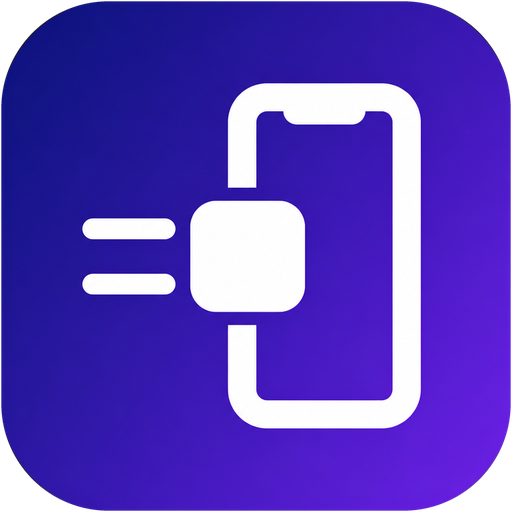
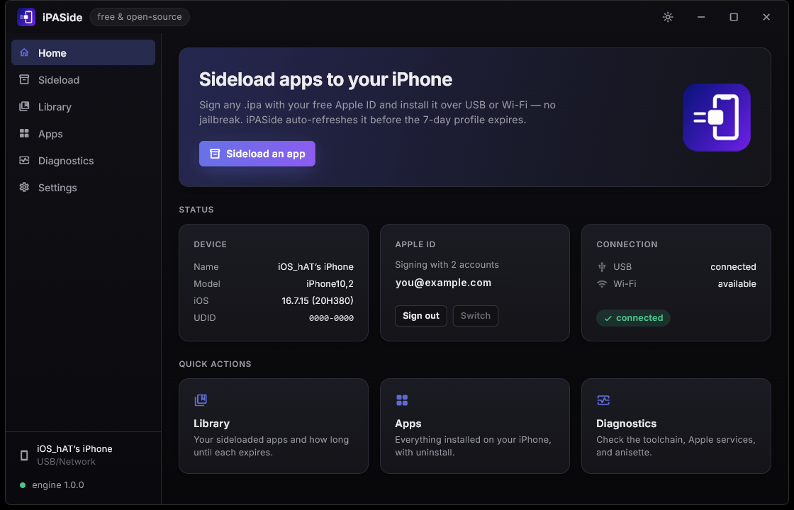
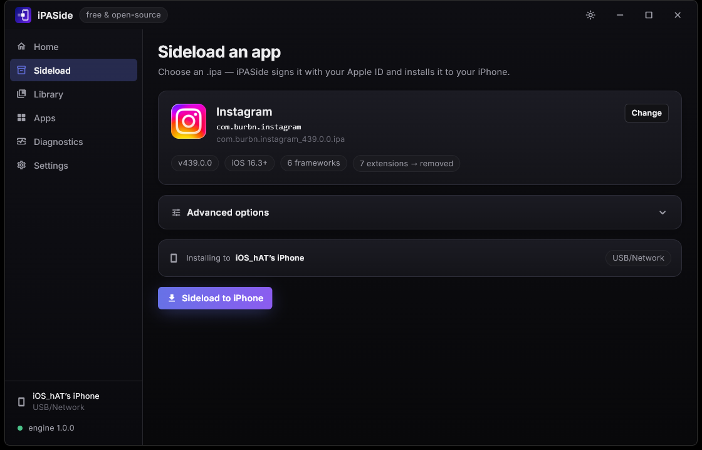
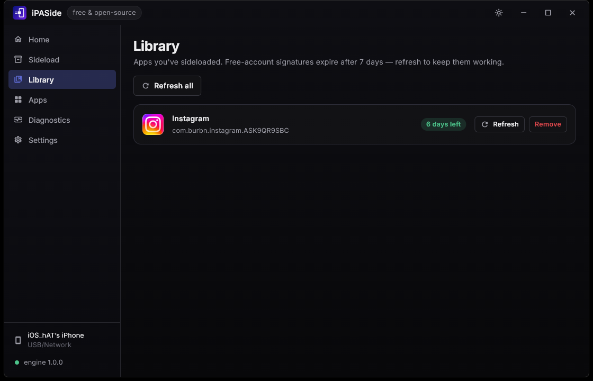
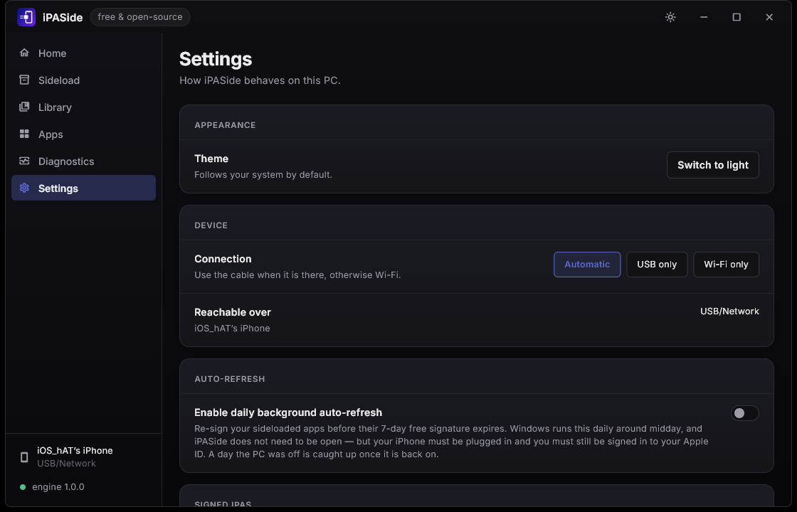
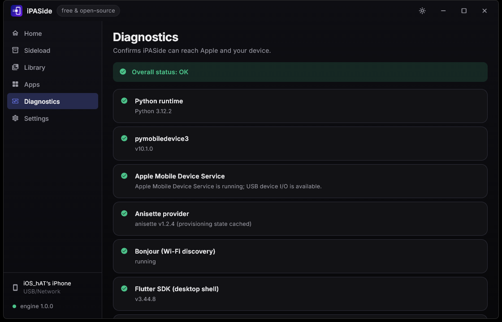
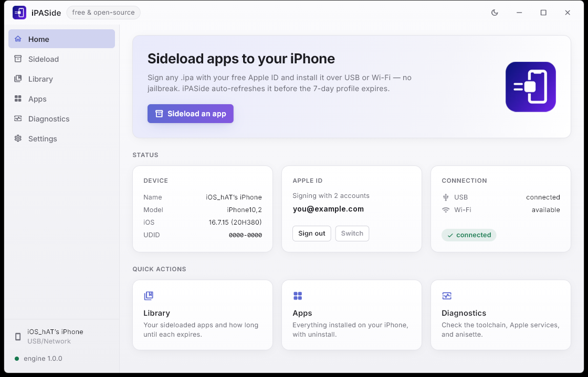

<div align="center">



# iPASide

**Put any app on your iPhone, from Windows, with just your Apple ID.**

No jailbreak. No paid developer account. No closed-source middleman.

[](https://github.com/pwnapplehat/iPASide/releases/latest)
[](LICENSE)
[](#get-started)
[](https://ipaside.com)

*Open source, end to end. Nothing between your Apple ID and Apple.*

</div>

---

## Get started

**1. Install iPASide.** Download the installer from the
[latest release](https://github.com/pwnapplehat/iPASide/releases/latest) and run it.
It installs just for you and never asks for administrator rights.

You also need Apple's **[Apple Devices](https://apps.microsoft.com/detail/9np83lwlpz9k)**
app (or iTunes) — that is what lets Windows talk to your iPhone over USB.

> **Windows will warn you.** It says *"Windows protected your PC"* because the
> installer is not code-signed, and a signing certificate is a recurring cost this
> project does not have. Choose **More info ▸ Run anyway**. If you would rather not
> trust a prebuilt file, every build step is scripted —
> see [Build it yourself](#build-it-yourself).

**2. Sign in.** Open iPASide and sign in with your Apple ID, then enter the code
Apple sends to your other device. A spare Apple ID is a good idea rather than your
main one.

**3. Plug in your iPhone**, unlock it, and tap **Trust**.

**4. Sideload.** Go to **Sideload**, drag an `.ipa` onto the window, and press
**Sideload to iPhone**.

**5. Trust the app on your phone.** Open **Settings ▸ General ▸ VPN & Device
Management** on the iPhone and trust your developer profile. The app will now open.

**6. Turn on auto-refresh** in iPASide's Settings. Apple's free signatures expire
after 7 days; this re-signs your apps before they do, in the background, without
iPASide needing to be open.

## What it looks like

**Home** — your phone, your Apple ID, and how the two are connected.



**Sideload** — drop in an `.ipa` and it reads the app's own icon and details, then
tells you exactly which device it is about to install to.



**Library** — everything you have sideloaded, and how long each has left. Refresh
one or all of them.



**Settings** — pick your connection, decide whether to keep signed `.ipa` files and
where they go, and turn on background refresh.



**Diagnostics** — one page that tells you whether everything it needs is working.



There is a full light theme too, and the sun in the title bar switches to it.



## What it can do

- **Sign and install any `.ipa`** with a free Apple ID, over **USB or Wi-Fi** —
  and you choose which, or let it prefer the cable.
- **Drag and drop anywhere** in the window. It reads the app's icon, version and
  contents straight from the file.
- **Inject tweaks** — drop in `.deb` packages (rootful, rootless or roothide) or
  raw `.dylib` files, as many as you like. Dylibs are pulled out of `.deb`s for you.
- **Keep your apps working.** The Library counts down each app's 7 days, and a
  daily background task re-signs whatever is due — no need to leave iPASide open.
- **Use more than one Apple ID.** Keep several signed in and switch without typing
  a password again — useful when one account has used up its ten App IDs for the
  week. A refresh always re-signs as the account that signed the app, because a
  different one produces something your phone will not install over it.
- **Watch it happen.** Provisioning, signing and installing are reported as they
  occur, down to the upload's byte count and the phone's own install steps.
- **Manage what is installed**, with real home-screen icons, and uninstall from
  your PC.
- **Advanced options** when you want them: custom bundle id or display name, strip
  extensions or device restrictions, enable Files-app sharing.
- **Keep the signed `.ipa`** if you want to reinstall it later without signing
  again, in a folder you choose.
- **Updates that check themselves.** iPASide notices a new release and verifies the
  download against the release's published checksums before it will run it. Nothing
  is downloaded uninvited, and nothing unverified is ever run.
- **Light and dark themes**, a chromeless window, and a single instance.

Your Apple ID is used **only** to sign in to Apple, over a connection pinned to
Apple's own certificate authority. It is never sent anywhere else, and there is no
iPASide server.

## What Apple's free account will not let you do

These are Apple's limits, not iPASide's. It works within them and tries to make
them visible rather than surprising:

- Apps **stop opening after 7 days** until they are re-signed. Use **Library ▸
  Refresh**, or leave auto-refresh on.
- **Only 3 sideloaded apps can be installed at once, per device.** Your phone counts
  every app signed by any free Apple ID, so a second account does not add slots -
  verified on hardware, and it is the limit most people run into first.
- You get roughly **10 App IDs per 7 days** - a separate ceiling, about registering
  identifiers rather than installing apps. The Library, and the `slots` command, show
  what you have used, and a second Apple ID gets you another ten of these.
- **App extensions** usually have to be removed — widgets, share sheets, keyboards
  and watch apps will not work. Each would need its own App ID.
- **Apps bought from the App Store cannot be re-signed.** They are encrypted;
  iPASide tells you when it sees one instead of failing obscurely.
- **iPhone and iPad only.** A tvOS, watchOS or visionOS `.ipa` is refused by name
  rather than signed and rejected by the device. Apple TV would need tvOS-scoped
  provisioning, which is not the same API path, and on Windows only an Apple TV with
  a USB port is reachable at all - portless models pair over the network in a way
  that currently works from macOS only.

## How it works

A Windows app driving a Python engine that does the Apple-facing work:

```
┌─────────────────────────────┐    JSON over stdio     ┌──────────────────────────┐
│  iPASide.Flutter (Dart)     │ ─────────────────────▶ │  iPASide.Engine (Python) │
│  chromeless desktop UI      │ ◀───────────────────── │  pymobiledevice3 + GSA   │
│  drag-drop, live progress   │     progress events    │  auth + anisette + zsign │
└─────────────────────────────┘                        └──────────────────────────┘
```

- **Device I/O** — `pymobiledevice3` (pure Python, Windows-native): pairing,
  lockdown, `installation_proxy` install, AFC staging, Developer Mode.
- **Apple ID auth** — GrandSlam (GSA, a modified SRP-6a) with **anisette** data
  generated locally, in-process and offline. No 32-bit Apple DLLs, no remote server.
- **TLS** — Apple's own `Apple Root CA` is pinned, and verification is never
  disabled anywhere in the codebase.
- **Provisioning** — the same `developerservices2.apple.com` API Xcode uses.
- **Signing** — a modern `zsign` (SHA256-only CodeDirectory, canonical DER
  entitlements), built from source, with dylib injection and extension stripping.
- **Auto-refresh** — a registry tracks each install's expiry, and a daily Windows
  scheduled task runs `iPASide.exe --auto-refresh` to re-sign what is due.

## Build it yourself

You need the **Flutter SDK** (3.44+) with **Visual Studio 2022** and its "Desktop
development with C++" workload, **Python 3.12**, and **MSYS2** to build `zsign`.
Windows **Developer Mode** must be on, because Flutter wires plugins up with
symlinks.

```powershell
# 1. Python engine (dev)
python -m venv .venv
.\.venv\Scripts\python -m pip install -r requirements-dev.txt

# 2. zsign (from an MSYS2 shell) -> src/iPASide.Engine/ipaside_engine/vendor/zsign.exe
bash tools/zsign/build-zsign.sh

# 3. Run the engine directly
cd src\iPASide.Engine
python -m ipaside_engine doctor
python -m ipaside_engine devices

# 4. Run the desktop app (dev; it finds the engine via the .venv automatically)
cd src\iPASide.Flutter
flutter run -d windows

# 5. Tests
python -m pytest                                  # engine
cd src\iPASide.Flutter; flutter test              # app

# 6. Full installer (portable engine + Flutter runner + Inno Setup)
powershell -File packaging\build-installer.ps1 -Version 1.0.0
```

Releasing is documented in [docs/releasing.md](docs/releasing.md), and the deferred
macOS work in [docs/macos-port.md](docs/macos-port.md).

## Engine CLI

The engine works on its own, without the app. Every command takes `--json`:

| Command | What it does |
|---|---|
| `doctor` | Check that everything it needs is working |
| `devices` / `device-info` | List or inspect connected devices |
| `login` | Apple ID sign-in (`--email`, `--code`, `--status`, `--accounts`, `--use`, `--logout`) |
| `inspect <ipa>` | Read an IPA's identity and icon without extracting it |
| `sideload <ipa>` | Provision, sign and install, with all the advanced options |
| `installs` / `refresh` / `forget` | Manage the registry and renew signatures |
| `signed` | Report or clean up kept `.ipa` files (`--clean`) |
| `slots` / `delete-app-id` | See and free App ID, device and certificate usage |
| `apps` / `uninstall` | Apps installed on the device |

Device commands take `--udid` to pick a phone and `--connection usb|wifi|auto` to
pick how to reach it.

## Status

Working end to end, and verified that way rather than assumed: iPASide signs and
installs real apps onto a physical **iPhone 8 Plus (iOS 16.7.15)** with a free
Apple ID, over USB. Each release is installed and driven against that device before
it is published.

Not yet verified: a full install over Wi-Fi (talking to the device over Wi-Fi does
work), two phones attached at once, and paid developer accounts.

## Legal

iPASide installs apps onto **your own device** using **your own Apple ID** — the
same mechanism Xcode uses to run an app you wrote. Only install software you are
entitled to run. iPASide is not affiliated with Apple Inc. Apple, iPhone and iOS
are trademarks of Apple Inc.

## License

[MIT](LICENSE) © 2026 iPASide Contributors.
